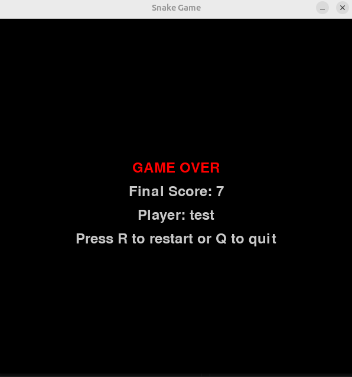
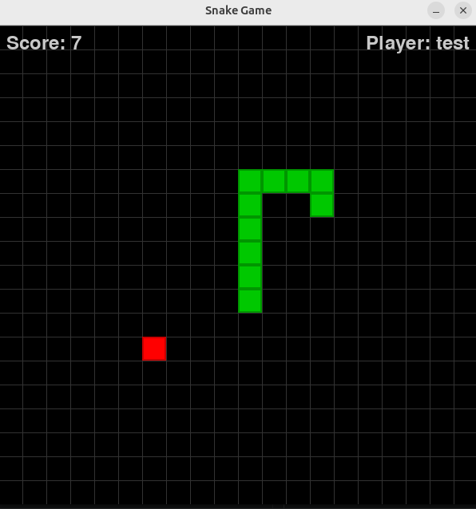
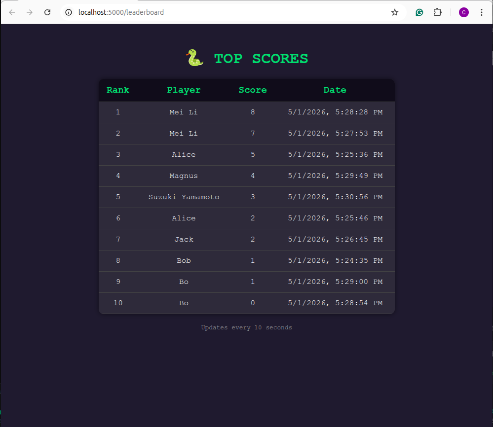

# Snake Game 🐍

# Snake Game 🐍

A classic Snake game built with Python and Pygame featuring **Human vs AI** mode! Control your snake, compete against an AI opponent, eat food to grow longer, and try to achieve the highest score!


## 🎮 Game Features

- **Two game modes**: Human vs AI (default) or single-player
- **AI opponent** with BFS pathfinding algorithm
- Smooth keyboard controls for human player
- Score tracking with player name input
- **Level progression** - speed increases every 5 points
- Self-collision and wall collision detection
- Pause functionality
- Game over screen with restart option
- Flask API + SQLite leaderboard (top 10 scores)
- Auto-refreshing web leaderboard
- Docker support with X11 forwarding for Linux

## 🎯 How to Play

### Controls
| Key | Action |
|-----|--------|
| ⬆️ Up Arrow | Move snake up |
| ⬇️ Down Arrow | Move snake down |
| ⬅️ Left Arrow | Move snake left |
| ➡️ Right Arrow | Move snake right |
| **P** | Pause the game |
| **Any Key** | Resume the game |
| **R** | Restart game (after game over) |
| **Q** | Quit game |

### Game Rules
1. Control the green snake to eat the red food blocks
2. AI controls the blue snake (in VS mode)
3. Each food eaten increases score by 1.5
4. Both snakes grow longer after eating
5. Game ends if either snake:
   - Hits the wall
   - Collides with its own body
   - Collides with the other snake
6. **Win condition**: Last snake standing wins!
7. Level increases every 5 points, making the game faster

### Game Modes

**Human vs AI Mode** (`VS_AI = True` - default):
- Compete against an AI snake using BFS pathfinding
- AI intelligently navigates toward food while avoiding collisions
- First snake to die loses

**Single-Player Mode** (`VS_AI = False`):
- Classic Snake experience
- Play against yourself to achieve high scores

## 🚀 Quick Start
```bash
# For Ubuntu system
./run.sh --rebuild
```

```text
--rebuild forces a fresh Docker image rebuild (useful after dependency changes).
```

- ✅ Detect if Docker is installed

- ✅ Start Docker daemon if needed

- ✅ Automatically fix permission issues (new!)

- ✅ Clean up port 5000

- ✅ Start the Snake Game

- ✅ Clean up when done

### Local Installation

1. **Clone the repository**
```bash
git clone https://github.com/boaca926-beep/sneak.git
cd snake-game
```

2. **Install dependencies**
```bash
pip install -r requirements.txt
# or
pip install pygame
```

3. **Start the Flask  API (for leaderboard)**
```bash
python score_api.py
```

3. **In a new terminal, run the game**
```bash
python snake.py
```

## 🐳 Docker Setup (For Linux with X11)

1. **Make the run script executable**
```bash
chmod +x run.sh
```

2. **Start the game**
```bash
./run.sh
```

3. **# Rebuild Docker image if needed**
```bash
./run.sh --rebuild
```

<p align="center">
  
  
</p>

3. **Rebuild Docker image if needed**
```bash
./run.sh --rebuild
```

## X11 Security Note
The script uses xhost +local:docker for simplicity. On multi‑user systems, use a more restrictive command:
```bash
xhost +SI:localuser:root
```

## Docker Configuration
The project includes Docker support for consistent development environments, especially useful for Linux systems with GUI forwarding.

### docker-compose.yml Features
- X11 display forwarding for GUI rendering

- Volume mounting for live code updates

- Network host mode for display access

- Environment variables for debugging and X11 configuration

### Manual Docker Commands
```bash
# Build the image
docker build -t snake-game .

# Run with GUI support
xhost +local:docker
docker compose up
docker compose down
xhost -local:docker
```

## 📁 Project Structure
```text
snake-game/
├── snake.py              # Main game implementation
├── score_api.py          # Flask API + SQLite leaderboard
├── leaderboard.html      # Auto‑refreshing web leaderboard
├── my_game.py            # Legacy/alternative game entry point
├── docker-compose.yml    # Docker orchestration
├── Dockerfile            # Docker image definition
├── run.sh                # Quick start script (with Docker & API)
├── inspect_db.sh         # SQLite inspection helper
├── requirements.txt      # Python dependencies (pip)
├── pyproject.toml        # Project metadata (PEP 621)
├── uv.lock               # uv package manager lock file
├── scores.db             # SQLite database (created at runtime)
├── figures/              # Screenshots for README (game_end.png, etc.)
└── scripts/              # Additional helper scripts (if any)
```

## Customization Options
Edit snake.py to modify game behavior:

| Variable | Description | Default |
|----------|-------------|---------|
| VS_AI | Toggle Human vs AI mode | True
| `CELL_SIZE` | Size of each grid cell (pixels) | 30 |
| `GRID_WIDTH` | Number of grid columns | 20 |
| `GRID_HEIGHT` | Number of grid rows | 20 |
| `LEVEL_EVERY` | Points needed to level up | 5 |
| `base_fps` | Starting game speed | 6 (Easy), 10 (Medium), 14 (Hard)|
| `SPEED_INCREMENT` | FPS increase per level| 0.5 |
| `MAX_FPS` | Maximum game speed | base_fps + 5 |

## Color Customization
```python
BLACK = (0, 0, 0)        # Background
GREEN = (0, 200, 0)      # Human snake body
DARK_GREEN = (0, 150, 0) # Human snake border
BLUE = (0, 100, 200)     # AI snake body
DARK_BLUE = (0, 50, 100) # AI snake border
RED = (255, 0, 0)        # Food
GRAY = (50, 50, 50)      # Grid lines
WHITE = (200, 200, 200)  # Text
```

## 🛠️ Development

### Prerequisites

- Python 3.12 or higher

- Pygame 2.6.1+

- Docker (optional, for containerized execution)

- X11 server (for Linux GUI support)

### Environment Variables (Docker)
```bash
DISPLAY=${DISPLAY}              # X11 display for GUI
ENABLE_DEBUG=${ENABLE_DEBUG}    # Debug mode toggle
QT_X11_NO_MITSHM=1              # X11 shared memory fix
LIBGL_ALWAYS_SOFTWARE=1         # Software rendering fallback
```

## 🎯 Future Enhancements
Potential features to add:

- ✅ Pause function (press P, and to resume press any key)
- ✅ Multiple difficulty levels (speed increases over time)
- ✅ High score tracking with persistent storage
- ✅ AI-controlled snake for demo mode
- Power-ups and special food types
- Sound effects and background music
- Two-player mode
- Different maze/wall configurations

## 🐛 Troubleshooting

### Common Issues

| Issue | Solution |
|-------|----------|
| "Error response from daemon: Conflict" | docker system prune -a && docker volume prune |
| "Cannot connect to X server" | `xhost +local:docker` and `export DISPLAY=$DISPLAY` |
| Pygame won't install | `sudo apt-get install python3-pygame` (Ubuntu) |
| Game runs too fast/slow | Adjust `FPS` in `snake.py` (higher = faster, lower = slower) |
| Docker GUI not showing | `export LIBGL_ALWAYS_SOFTWARE=1` |
| Leaderboard shows no data | Ensure API is running on `localhost:5000` before opening `leaderboard.html` |
| Port 5000 already in use | `fuser -k 5000/tcp` (Linux) or stop the process using the port |

## Flask API with SQLite that stores the highest scores and allows retrieval of the top 10.
```bash
score_api.py
```

### Run the API
```bash
python score_api.py

# Add a score
#curl -X POST http://localhost:5000/score \
#  -H "Content-Type: application/json" \
#  -d '{"player_name":"Bo","score":350}'

# Get top 10 scores
curl http://localhost:5000/top-scores
```

## Persistent Storage in Docker
Add a volume to docker-compose.yml to keep scores.db across container restarts:
```yaml
volumes:
  - ./data:/app/data
```

## Inspect Database
```bash
# Run SQlite
./inspect_db.sh
```

**Operations**
```sql
.tables          -- should show 'scores'
.schema scores   -- see table structure
SELECT * FROM scores;
```

## Auto‑refreshing leaderboard window

### 1. Create leaderboard.html in the project folder
```bash
leaderboard.html
```
<p align="center">
  
</p>

### 2. Modify snake.py to open the leaderboard
```python
import webbrowser   # add at the top

# ... inside main(), after getting player_name:

# Open the leaderboard window (only once)
leaderboard_path = os.path.join(os.path.dirname(__file__), "leaderboard.html")
webbrowser.open(f"file://{leaderboard_path}", new=2)  # new=2 opens in new tab if possible
```

### 3. Make sure the API is reachable
```bash
- The score-api container must be running and accessible on localhost:5000.

- The docker-compose.yml already maps "5000:5000", so the host can reach it.

- The browser (running on local host) will fetch http://localhost:5000/top-scores without any problem.
```

### 4. Full integration to snake.py
```python
# At the top
import webbrowser
import os

# Inside main(), after player_name is known:
leaderboard_url = f"file://{os.path.abspath('leaderboard.html')}"
webbrowser.open(leaderboard_url)
```

## How to evolve this project toward data engineering

-Replace SQLite with PostgreSQL (or use both). Add Docker Compose service for Postgres. Show you can connect to a production‑grade database.

- Add a data pipeline: every time a score is submitted, also write to a raw log table. Create a scheduled job (e.g., inside the API) that aggregates daily top scores into a summary table (leaderboard snapshot).

- Implement a simple ETL script: export scores to a CSV/Parquet file, or load them into a second database for analytics.

- Use environment‑aware config – expand to load different configs for dev/prod.

- Add metrics / monitoring: track number of scores per hour, average score, etc. Expose via a new /stats endpoint.

- Containerize with Airflow (complex but impressive): create a DAG that runs deduplication SQL every hour instead of at game start.

- Push to cloud storage: after the game is closed, automatically upload scores.db to S3 or Google Cloud Storage.
## Add a Desktop short-cut with icon
**Create $HOME/.local/share/applications/snake-game.desktop with:**
```bash
Version=1.0
Name=Snake Game
Comment=Play the Snake Game in a Docker container
Exec=gnome-terminal --working-directory=$HOME/Desktop/sneak -- bash -c "./run.sh; echo 'Press Enter to exit...'; read"
Icon=utilities-terminal
Terminal=false
Type=Application
Categories=Game;
StartupNotify=true
```

**Update the script**
```bash
update-desktop-database ~/.local/share/applications/
# Change ownership
chmod +x ~/.local/share/applications/snake-game.desktop
```

**Add a Desktop short-cut with icon**
```bash
cp ~/.local/share/applications/snake-game.desktop ~/Desktop/
# Test run
gtk-launch snake-game.desktop
```
Replace gnome-terminal with xterm if needed. Place a custom snake-icon.png in ~/.local/share/icons/.

**Update the desktop database:**
```bash
update-desktop-database ~/.local/share/applications/
chmod +x ~/.local/share/applications/snake-game.desktop
```

**Add a Desktop shortcut:**
```bash
cp ~/.local/share/applications/snake-game.desktop ~/Desktop/
# Test run
gtk-launch snake-game.desktop
```
## Docker Cleanup
### Deep clean of Docker resources
docker system prune -a && docker volume prune

### Or use the alias (add to ~/.bashrc)
alias docker-clean='docker system prune -a && docker volume prune'

## For Data Engineer
```bash
- Replace SQLite with PostgreSQL - Add Docker Compose service for Postgres

- Add data pipeline - Write scores to raw log table, create scheduled aggregations

- Implement ETL script - Export scores to CSV/Parquet or load to analytics DB

- Add metrics/monitoring - Track scores per hour, average score via /stats endpoint

- Containerize with Airflow - Create DAGs for deduplication and analytics

- Cloud storage integration - Auto-upload scores.db to S3/GCS
```

## For ML/AI Engineer
```bash
For ML / AI Engineer

- Train RL agent - Use reinforcement learning to train a better snake AI

- Deploy model API - Serve pre-trained models with Docker

- Model retraining pipeline - Trigger retraining when new scores arrive

- Compare AI strategies - Implement and benchmark different pathfinding algorithms
```

## Note
- Human and AI move at the same speed (same FPS)

Both snakes score 1.5 points per food (keeps competition fair)

AI uses BFS for optimal pathfinding - it's quite challenging!

To make the AI easier, add random movement or longer path selection
